# Projeto Operating Systems: API, Logs e Anonimização

# Integrantes

- RM99499 – Guilherme Monteiro Espim
- RM99279 – João Paulo Fonseca Zamperlini
- RM98297 – Lucas Pisaneschi Speranzini
- RM97937 – Pedro Henrique Fernandes Lô de Barros
- RM97824 – Vinicius Oliveira de Barros

## Sinopse

Este projeto integra conceitos de **Sistemas Operacionais** com tecnologias como **Docker, Node.js, SQLite e Shell Script**. O objetivo principal é desenvolver uma aplicação que demonstre controle de usuários, gerenciamento de logs e anonimização de dados sensíveis, aplicando princípios de segurança e isolamento de privilégios.

---

## Objetivos do Projeto

- Configurar um ambiente Docker com servidor NGINX e aplicação Node.js
- Implementar uma API REST com integração a banco de dados SQLite
- Criar volumes persistentes para garantir integridade de dados
- Desenvolver sistema de logging e auditoria
- Implementar script de anonimização de dados sensíveis
- Aplicar controle de permissões e isolamento de usuários
- Documentar e demonstrar funcionamento através de vídeo

---

## 1. Estrutura e Objetivo Geral

- **API Node.js**: Endpoints para inserção de usuários e gravação de logs
- **Banco de Dados SQLite**: Persistência em volume externo
- **Scripts Shell**: Anonimização de dados e gerenciamento de permissões
- **Sistema de Logs**: Auditoria centralizada em `/var/log/xp_access.log`

**Comando de validação da estrutura:**
```bash
ls -lh /root /opt /usr/local/bin
```

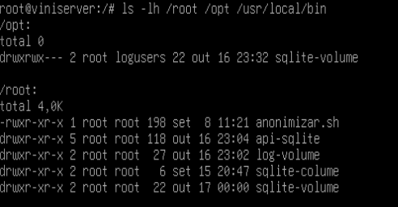

---

## 2. Configuração do Servidor e Docker

O servidor foi configurado com **Docker** e **NGINX**, garantindo acesso à rede e suporte adequado à execução de containers para a aplicação Node.js.

**Validação dos serviços:**
```bash
systemctl status docker
systemctl status nginx
docker --version
```


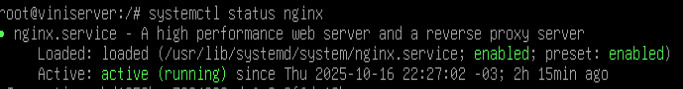
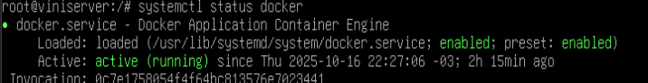

---

## 3. Banco de Dados SQLite Persistente

O banco de dados SQLite foi criado dentro de um volume local, garantindo que os dados não se percam quando o container for encerrado. A estratégia de persistência funciona da seguinte forma:

- Volume montado no host em `/root/sqlite-volume`
- Volume montado no container em `/app/sqlite-volume`
- Arquivo de banco: `banco.db`

**Validação do volume:**
```bash
ls -lh /root/sqlite-volume/
```

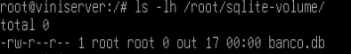

**Validação das tabelas criadas:**
```bash
sqlite3 /root/sqlite-volume/banco.db '.tables'
```

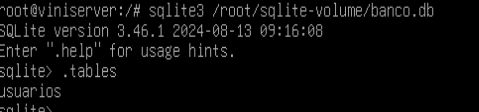

---

## 4. API Node.js com SQLite

A aplicação foi desenvolvida com **Express.js** e **SQLite3**, oferecendo dois endpoints principais.

**Execução da API:**
```bash
docker run -it --rm \
  -v /root/api-sqlite:/app \
  -v /root/sqlite-volume:/app/sqlite-volume \
  -w /app -p 3000:3000 node:20 node index.js
```

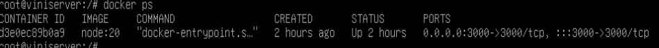

### 4.1 Endpoint `/usuarios`

Permite inserir dados de usuários (nome e CPF) no banco de dados SQLite, testando a persistência e integração do Node.js com o volume montado.

**Comando de teste:**
```bash
curl -X POST http://localhost:3000/usuarios \
  -H "Content-Type: application/json" \
  -d '{"nome": "Vinicius", "cpf": "12345678900"}'
```

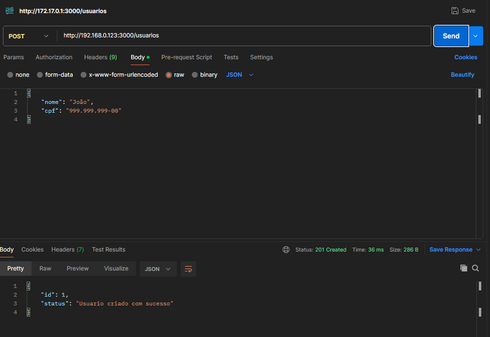

**Verificação no banco de dados:**
```bash
sqlite3 /root/sqlite-volume/banco.db "SELECT * FROM usuarios;"
```

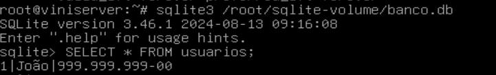

### 4.2 Endpoint `/log`

Grava mensagens de log em `/var/log/xp_access.log`, registrando eventos e execuções da aplicação.

**Comando de teste:**
```bash
curl -X POST http://localhost:3000/log \
  -H "Content-Type: application/json" \
  -d '{"mensagem": "Usuário acessou o sistema"}'
```

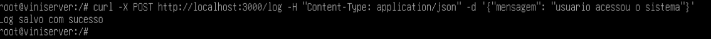

**Validação dos logs:**
```bash
cat /var/log/xp_access.log
```

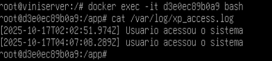

---

## 5. Criação de Usuários e Permissões

Foram criados usuários e grupos específicos para isolar acessos e aplicar o princípio do menor privilégio.

**Configuração de usuários e permissões:**
```bash
groupadd logusers
useradd -m ana
usermod -aG logusers ana
chown root:logusers /opt/sqlite-volume/banco.db
chmod 660 /opt/sqlite-volume/banco.db
```


**Verificação das permissões do banco:**
```bash
ls -lh /opt/sqlite-volume/banco.db
```

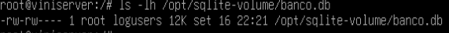

O grupo `logusers` possui:
- Permissão de escrita em `/var/log`
- Acesso ao banco de dados para execução do script de anonimização
- Privilégios limitados e controlados

---

## 6. Script de Anonimização (`anonimizar.sh`)

O script foi desenvolvido para anonimizar dados sensíveis, substituindo valores reais por máscaras. Está localizado em `/usr/local/bin` com permissões de execução para o grupo `logusers`.

**Conteúdo do script:**
```bash
cat /usr/local/bin/anonimizar.sh
```

**Aplicação de permissões de execução:**
```bash
chmod +x /usr/local/bin/anonimizar.sh
ls -l /usr/local/bin/anonimizar.sh
```

**Características do script:**
- Acessa o banco de dados SQLite
- Substitui CPF por padrão mascarado (e.g., `***.***.***-**`)
- Registra todas as operações nos logs
- Executa com privilégios restritos

---

## 7. Execução com Usuário Limitado

A usuária `ana` (pertencente ao grupo `logusers`) executa o script sem privilégios de root, comprovando a implementação correta de controle de acesso e isolamento de privilégios.

**Verificação dos grupos do usuário ana:**
```bash
groups ana
```

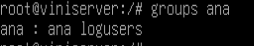

**Execução do script por usuário limitado:**
```bash
su - ana
/usr/local/bin/anonimizar.sh
```


---

## 8. Verificação de Dados Anonimizados

Após a execução do script, os dados sensíveis foram anonimizados no banco de dados.

**Verificação dos dados anonimizados:**
```bash
sqlite3 /root/sqlite-volume/banco.db "SELECT * FROM usuarios;"
```

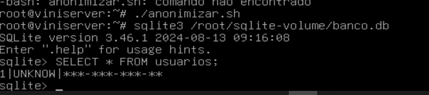

O CPF agora aparece mascarado, protegendo os dados pessoais dos usuários.

---


## Documentação

O arquivo `README.md` do projeto documenta:
- Estrutura geral da aplicação
- Comandos de execução e teste
- Propósito de cada componente


---

## ✅ Conclusão

Este projeto demonstra a aplicação prática de conceitos de Sistemas Operacionais, incluindo:

- **Isolamento e Containerização**: Docker para ambiente controlado
- **Controle de Acesso**: Permissões e grupos de usuários
- **Persistência de Dados**: Volumes e banco de dados
- **Auditoria e Segurança**: Sistema centralizado de logs
- **Anonimização de dados**: Proteção de dados sensíveis

A integração dessas tecnologias resulta em uma aplicação robusta, segura e rastreável, aplicando as melhores práticas de desenvolvimento e administração de sistemas.
